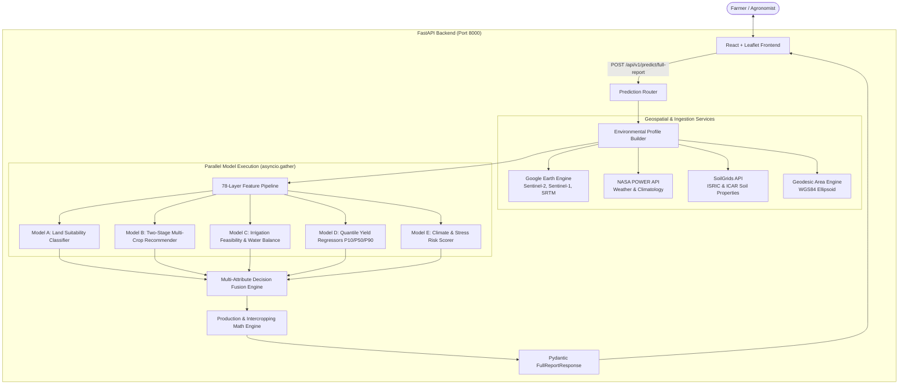

# 🌾 GeoAgri AI – India Edition

> **Next-Generation Geospatial & AI-Powered Agricultural Decision Support System**  
> Location-based multi-crop recommendation, probabilistic quantile yield prediction, irrigation feasibility analysis, and climate risk assessment for Indian agriculture.

[](https://fastapi.tiangolo.com)
[](https://reactjs.org)
[](https://vitejs.dev)
[](https://www.typescriptlang.org/)
[](https://www.python.org/)
[](https://opensource.org/licenses/MIT)

---

## 📋 Table of Contents

- [Overview](#-overview)
- [Key Features](#-key-features)
- [System Architecture](#-system-architecture)
- [The 5 Core AI Models (Parallel Async Pipeline)](#-the-5-core-ai-models-parallel-async-pipeline)
- [78-Layer Feature Engineering Pipeline](#-78-layer-feature-engineering-pipeline)
- [Multi-Attribute Decision Fusion Engine](#-multi-attribute-decision-fusion-engine)
- [Project Structure](#-project-structure)
- [Tech Stack](#-tech-stack)
- [Getting Started](#-getting-started)
  - [Prerequisites](#prerequisites)
  - [Backend Setup](#1-backend-setup-fastapi)
  - [Frontend Setup](#2-frontend-setup-react--vite)
  - [Running Both Simultaneously](#3-running-both-simultaneously)
- [Docker Deployment](#-docker-deployment)
- [API Reference](#-api-reference)
- [ML Pipeline & Training](#-ml-pipeline--training)
- [Testing & Quality Assurance](#-testing--quality-assurance)
- [Configuration & Environment Variables](#-configuration--environment-variables)
- [Resilience & Fallback Architecture](#-resilience--fallback-architecture)

---

## 🌟 Overview

**GeoAgri AI** is an end-to-end precision agriculture intelligence platform tailored specifically for Indian agro-climatic zones. By marrying **multispectral satellite imagery (Sentinel-2)**, **synthetic aperture radar (Sentinel-1 SAR)**, **topographic digital elevation models (SRTM DEM)**, **high-resolution soil properties (ISRIC SoilGrids / ICAR)**, and **gridded agro-meteorological climatology (NASA POWER)**, GeoAgri AI provides actionable, farm-specific intelligence to farmers, agronomists, and policy planners.

Unlike basic crop suggestion tools that simply query a static lookup table, GeoAgri AI executes a **78-layer geospatial feature extraction pipeline** feeding **5 specialized machine learning and agronomic models concurrently**, followed by a **multi-attribute decision fusion engine** to synthesize tailored crop recommendations with risk and profit metrics.

---

## 🚀 Key Features

* **Interactive GIS Field Polygon Selector:**
  Draw precise farm boundaries or select coordinates anywhere in India on a dynamic Leaflet map. Geodesic field area calculation (`ha` and `acres`) occurs in real time.
* **100+ Indian Crop Profiles:**
  Covers cereals, pulses, oilseeds, cash crops, vegetables, fruits, and spices across Kharif, Rabi, Zaid, and annual cropping seasons with verified agronomic thresholds.
* **FAO Land Suitability Classification:**
  Scores field conditions using the international FAO land evaluation framework into grades: **S1 (Highly Suitable)**, **S2 (Moderately Suitable)**, **S3 (Marginally Suitable)**, and **N (Not Suitable)**, detailing limiting factors.
* **Probabilistic Quantile Yield Modeling (P10 / P50 / P90):**
  Yield predictions are presented not as a naive single number, but as a risk-aware distribution:
  * **P10 (Worst-case / 10th percentile):** Downside protection under adverse weather.
  * **P50 (Median / Expected):** Realistic seasonal expectation.
  * **P90 (Optimistic / 90th percentile):** Bumper crop potential under ideal conditions.
* **Water Balance & Irrigation Feasibility:**
  Computes crop evapotranspiration ($ET_0 \times K_c$), effective seasonal rainfall, and soil moisture capacity to prescribe irrigation modes: **Rainfed**, **Supplemental**, or **Full Irrigation**.
* **Climate Stress & Phenological Risk Scoring:**
  Monitors heat stress, terminal drought, and excess rainfall vulnerabilities for each crop during critical vegetative and flowering windows.
* **Intercropping & Companion Crop Optimization:**
  Identifies symbiotic companion crops (e.g., Maize + Cowpea, Cotton + Green Gram), estimating percentage yield boost, land equivalent ratio, and secondary production tonnage.
* **Manual Soil & Agronomic Overrides:**
  Allows agronomists to override satellite/SoilGrids estimates with physical soil lab test values (pH, soil organic carbon).
* **Zero-Downtime Resilience & Offline Fallbacks:**
  Every data ingestion layer (GEE, NASA POWER, SoilGrids) and ML model features built-in high-fidelity fallback generators, allowing complete offline functionality or development without live API keys.

---

## 🏗 System Architecture



---

## 🧠 The 5 Core AI Models (Parallel Async Pipeline)

All five models are invoked asynchronously in parallel using `asyncio.gather`, isolated with individual try-catch fallback handlers so a failure in one model never degrades or crashes the broader system:

| Model | Purpose | Technique / Algorithm | Outputs |
| :--- | :--- | :--- | :--- |
| **Model A: Land Suitability** | Evaluates basic terrain and soil physics for crop production | Multi-criteria evaluation of pH, SOC, slope, TWI, and baseline NDVI | Suitability Grade (`S1`, `S2`, `S3`, `N`), Numerical score (0–1), Limiting factors list |
| **Model B: Multi-Crop Recommender** | Selects optimal crops for the geo-location and season | Two-stage hybrid: Random Forest ML classifier + Agronomic filter rule table (`agronomic_rules.yaml`) | Ranked list of crops with match percentage and confidence score |
| **Model C: Irrigation Feasibility** | Assesses water requirements and moisture availability | Hydrological water-balance model ($ET_0 \times K_c$ vs. effective rainfall + root-zone moisture) | Irrigation mode (`rainfed`, `supplemental`, `full`), water deficit in mm |
| **Model D: Quantile Yield Regressor** | Forecasts crop yield with statistical risk boundaries | Quantile Gradient Boosting Regressors trained on historical Indian yield records | Quantile yields in tonnes/ha (`P10`, `P50`, `P90`) and total field tonnage |
| **Model E: Climate Risk Scorer** | Identifies climate anomalies and vulnerabilities | Extreme value analysis of heat waves, dry spells, and rainfall volatility | Risk score (0–100), Level (`Low`, `Moderate`, `High`), Stage-specific risk notes |

---

## 🛰 78-Layer Feature Engineering Pipeline

The system consolidates 78 geospatial and bio-climatic features extracted across satellite, atmospheric, and pedological layers:

```
├── Topographic & Terrain (SRTM DEM 30m) [5 features]
│   ├── elevation_mean, slope_mean, aspect_mean, hillshade_mean, twi_mean (Topographic Wetness Index)
├── Multispectral Indices (Copernicus Sentinel-2 MSI) [8 features]
│   ├── ndvi_mean (Vegetation Index), ndwi_mean (Water Index), evi_mean (Enhanced Veg Index)
│   ├── savi_mean (Soil Adjusted Veg Index), ndmi_mean (Moisture Index), nbr_mean (Burn Ratio)
│   ├── gndvi_mean (Green NDVI), ndsi_mean (Snow/Salinity Index)
├── Raw Spectral Bands & Textural Stats (Sentinel-2) [21 features]
│   ├── b1_mean through b12_mean (Coastal, Blue, Green, Red, RedEdge 1-4, NIR, SWIR-1, SWIR-2)
│   ├── Band standard deviations, maximums, and minimums (b2_std, b4_max, b8_min, b11_max, etc.)
├── Synthetic Aperture Radar (Sentinel-1 SAR C-Band) [8 features]
│   ├── vv_mean, vh_mean (Backscatter cross-sections)
│   ├── vv_vh_ratio_mean, rvi_mean (Radar Vegetation Index)
│   ├── vv_std, vh_std, vv_vh_ratio_std, rvi_std (Surface roughness and canopy texture)
├── Agro-Climatology & Weather (NASA POWER) [6 features]
│   ├── rainfall_mm, temp_max_c, temp_min_c, temp_mean_c, humidity_pct, solar_radiation_mj_m2
├── Physical & Chemical Soil Grids (ISRIC / ICAR) [8 features]
│   ├── ph (H2O), organic_carbon_g_kg (SOC), nitrogen_g_kg
│   ├── phosphorus_ppm, potassium_ppm
│   ├── texture_clay_pct, texture_sand_pct, texture_silt_pct
└── Spatial Dispersion & Dispersion Stats [22 features]
    └── Variance, standard deviation, and quantile spreads of spectral & terrain indices
```

---

## ⚖️ Multi-Attribute Decision Fusion Engine

Raw model outputs are synthesized into a final crop ranking using a calibrated multi-attribute utility function:

$$\text{RawScore} = w_1 S_{\text{land}} + w_2 S_{\text{rec}} - w_3 C_{\text{irrigation}} + w_4 Y_{\text{yield}} - w_5 R_{\text{climate}}$$

### Default Weight Configuration:
* **Land Suitability ($w_1$):** `0.20`
* **Crop Suitability ML ($w_2$):** `0.25`
* **Irrigation Deficit Penalty ($w_3$):** `0.15`
* **Yield Potential ($w_4$):** `0.25`
* **Climate Risk Penalty ($w_5$):** `0.15`

> **Dynamic Irrigation Re-weighting:**  
> When a user selects a strict **Rainfed** preference, the engine dynamically increases the irrigation penalty weight to heavily discount water-intensive crops (e.g., Sugarcane, Paddy) and promote drought-tolerant alternatives (e.g., Millets, Pulses).

---

## 📁 Project Structure

```
GeoAgri/
├── backend/
│   ├── app/
│   │   ├── api/
│   │   │   └── v1/
│   │   │       ├── predict.py          # POST /api/v1/predict/full-report endpoint
│   │   │       ├── field.py            # POST /api/v1/field/area geodesic calculation
│   │   │       └── health.py           # GET /api/v1/health & GET /api/v1/crops
│   │   ├── models/                     # The 5 Core Models
│   │   │   ├── model_a_suitability/    # FAO land suitability classifier
│   │   │   ├── model_b_recommendation/ # Two-stage ML + rule-based crop recommender
│   │   │   ├── model_c_irrigation/     # Water balance & irrigation feasibility
│   │   │   ├── model_d_yield/          # Quantile yield regressors (P10/P50/P90)
│   │   │   ├── model_e_climate_risk/   # Climate stress & risk scorer
│   │   │   └── registry.py             # Parallel model runner with fallback isolation
│   │   ├── rules/
│   │   │   └── agronomic_rules.yaml    # Temperature, rainfall, and pH constraints
│   │   ├── schemas/
│   │   │   └── predict.py              # Pydantic v2 validation and response models
│   │   ├── services/
│   │   │   ├── crops/                  # 100+ Crop profiles registry & normalizers
│   │   │   ├── features/               # 78-layer profile builders & pipelines
│   │   │   ├── fusion/                 # Multi-attribute decision fusion engine
│   │   │   ├── geo/                    # GEE client & geodesic area calculation
│   │   │   ├── soil/                   # ISRIC SoilGrids REST integration
│   │   │   └── weather/                # NASA POWER weather client
│   │   └── main.py                     # FastAPI application entrypoint & CORS config
│   ├── ml/
│   │   ├── data/                       # Raw and processed datasets
│   │   ├── models/                     # Trained .joblib models & feature_manifest.json
│   │   └── training/                   # Synthetic generators, preprocessing, and training
│   ├── tests/                          # Complete Pytest test suite (Phase 2 to 7)
│   ├── Dockerfile                      # Production container spec
│   └── requirements.txt                # Python dependencies
│
├── frontend/
│   ├── src/
│   │   ├── api/
│   │   │   └── client.ts               # Axios/Fetch client for backend communication
│   │   ├── components/
│   │   │   ├── MapSelector/            # Leaflet map with polygon/point drawing
│   │   │   ├── SuitabilityBanner/      # FAO Suitability grade and limiting factors
│   │   │   ├── CropTable/              # Recommended crops table & search
│   │   │   ├── YieldChart/             # Recharts quantile yield distribution (P10/50/90)
│   │   │   ├── IrrigationPanel/        # Irrigation feasibility & water requirements
│   │   │   ├── ClimateRiskReport/      # Drought, heat, and volatility risk metrics
│   │   │   ├── IntercropPanel/         # Companion crop pairings & boost calculations
│   │   │   ├── FieldSummaryCard/       # Area, centroid, and environmental metrics
│   │   │   └── DiagnosticsPanel/       # Model status, latency, and data health
│   │   ├── pages/
│   │   │   └── Dashboard.tsx           # Main agronomic dashboard page
│   │   ├── App.tsx                     # Top-level application component
│   │   └── index.css                   # Custom modern dark glassmorphism styling
│   ├── index.html                      # HTML template
│   ├── package.json                    # Node dependencies and scripts
│   └── vite.config.js                  # Vite configuration
│
└── README.md                           # Documentation
```

---

## 💻 Tech Stack

### Backend
* **Language & Framework:** Python 3.11+, FastAPI (Asynchronous REST API)
* **Server:** Uvicorn (ASGI web server)
* **Data Validation:** Pydantic v2 & Pydantic-Settings
* **Geospatial & Remote Sensing:** Google Earth Engine Python API (`earthengine-api`), Shapely, PyProj
* **Machine Learning & Analytics:** Scikit-Learn, LightGBM, NumPy, Pandas, Joblib
* **Testing:** PyTest, PyTest-Asyncio, HTTPX

### Frontend
* **Core:** React 18, TypeScript, Vite
* **Mapping:** Leaflet & React-Leaflet
* **Visualizations:** Recharts (Interactive quantile yield charts)
* **Icons:** Lucide-React
* **Styling:** Vanilla CSS with custom design tokens (Dark mode, Glassmorphism, Micro-animations)

---

## 🛠 Getting Started

### Prerequisites

Ensure you have the following installed on your machine:
* **Python 3.10+** (Recommended: 3.11)
* **Node.js 18+** & **npm**

---

### 1. Backend Setup (FastAPI)

1. Open a terminal and navigate to the backend folder:
   ```bash
   cd backend
   ```

2. Create and activate a Python virtual environment:
   ```bash
   # On macOS/Linux:
   python3 -m venv .venv
   source .venv/bin/activate

   # On Windows (cmd/powershell):
   # python -m venv .venv
   # .venv\Scripts\activate
   ```

3. Install the required Python packages:
   ```bash
   pip install --upgrade pip
   pip install -r requirements.txt
   ```

4. Configure the environment variables (optional, defaults work out-of-the-box):
   ```bash
   cp .env.example .env
   ```

5. Launch the FastAPI backend server:
   ```bash
   python3 -m uvicorn app.main:app --host 0.0.0.0 --port 8000 --reload
   ```

The backend API will start at **`http://localhost:8000`**.  
Interactive Swagger documentation is available at **`http://localhost:8000/docs`**.

---

### 2. Frontend Setup (React + Vite)

1. Open a **second terminal tab** and navigate to the frontend directory:
   ```bash
   cd frontend
   ```

2. Install the frontend dependencies:
   ```bash
   npm install
   ```

3. Start the Vite development server:
   ```bash
   npm run dev
   ```

The web dashboard will be accessible at **`http://localhost:5173`**.

---

### 3. Running Both Simultaneously

If you prefer starting both servers from a single terminal command:

```bash
(cd backend && ./.venv/bin/uvicorn app.main:app --reload --port 8000) & (cd frontend && npm run dev)
```

---

## 🐳 Docker Deployment

A production-ready Dockerfile is included for containerized deployment:

```bash
# Build the backend Docker image
docker build -t geoagri-backend -f backend/Dockerfile .

# Run the container exposing port 8000
docker run -d -p 8000:8000 --name geoagri-backend geoagri-backend
```

---

## 📡 API Reference

### 1. Generate Full Agricultural Decision Report
* **Endpoint:** `POST /api/v1/predict/full-report`
* **Content-Type:** `application/json`

**Sample Request Body:**
```json
{
  "polygon": [
    [78.4850, 17.3850],
    [78.4870, 17.3850],
    [78.4870, 17.3870],
    [78.4850, 17.3870],
    [78.4850, 17.3850]
  ],
  "point": null,
  "season": "kharif",
  "limit": 10,
  "irrigation_preference": "rainfed",
  "manual_soil": {
    "ph": 6.8,
    "organic_carbon": 12.5
  }
}
```

**Key Response Fields:**
* `field_summary`: Geodesic area in hectares/acres, centroid coordinates, bounding box.
* `land_suitability`: Overall FAO grade (`S1`, `S2`, `S3`, `N`), score, confidence, limiting factors.
* `environment`: Aggregated soil attributes (pH, SOC, N, P, K) and weather parameters (rainfall, temperatures).
* `satellite_features`: Computed remote sensing indices (`NDVI`, `NDWI`, `EVI`, `SAVI`, `TWI`, `Slope`).
* `recommended_crops`: Array of top crops sorted by recommendation score, containing:
  * `expected_yield_t_ha`: Quantiles `p10`, `p50`, `p90`.
  * `expected_production_t`: Total yield scaled to field area.
  * `irrigation_mode`: `rainfed`, `supplemental`, or `full`.
  * `climate_risk_score` & `climate_risk_note`.
  * `intercrop_options`: Recommended companion crops with yield boost percentages.
* `model_status`: Health and fallback status of Models A through E.

---

### 2. Instant Field Geodesic Area Calculation
* **Endpoint:** `POST /api/v1/field/area`
* **Description:** Computes exact surface area on the WGS84 ellipsoid for interactive polygon changes.

---

### 3. List Registered Indian Crops
* **Endpoint:** `GET /api/v1/crops`
* **Description:** Returns the complete registry of 100+ Indian crops with baseline agronomic ranges.

---

### 4. Health & Integration Diagnostics
* **Endpoint:** `GET /api/v1/health`
* **Description:** Validates connectivity to Google Earth Engine, NASA POWER, and SoilGrids APIs.

---

## 🔬 ML Pipeline & Training

The machine learning models are pre-trained and saved in `backend/ml/models/`. If you want to regenerate training data, re-run feature selection, or retrain the models:

```bash
# 1. Generate or update synthetic baseline datasets
PYTHONPATH=backend python3 backend/ml/training/generate_sample_data.py

# 2. Run data preprocessing and normalization
PYTHONPATH=backend python3 backend/ml/training/preprocess.py

# 3. Perform low-variance and correlation-based feature selection (yielding 78 features)
PYTHONPATH=backend python3 backend/ml/training/select_features.py

# 4. Train Random Forest and Quantile Gradient Boosting models
PYTHONPATH=backend python3 backend/ml/training/train_models.py

# 5. Generate validation charts (Feature importance, ROC, Yield Quantiles)
PYTHONPATH=backend python3 backend/ml/training/generate_result_charts.py
```

---

## 🧪 Testing & Quality Assurance

The codebase features comprehensive automated unit and integration tests across each architectural phase:

```bash
cd backend
PYTHONPATH=. pytest -v
```

### Test Suite Structure:
* `tests/test_phase2_data.py`: Validates raw and processed crop data schemas and normalizations.
* `tests/test_phase3_geo_services.py`: Tests GEE satellite extraction, NASA POWER, and SoilGrids integrations.
* `tests/test_phase4_features.py`: Verifies the 78-layer feature vector extraction pipeline.
* `tests/test_phase5_models.py`: Validates Models A, B, C, D, and E outputs and boundary conditions.
* `tests/test_phase6_fusion.py`: Verifies multi-attribute decision weighting and ranking logic.
* `tests/test_phase7_api.py`: End-to-end API route testing (`/predict/full-report`, `/field/area`, `/health`).

---

## ⚙️ Configuration & Environment Variables

Create a `backend/.env` file to customize settings:

| Variable | Default Value | Description |
| :--- | :--- | :--- |
| `ENV` | `development` | Deployment environment (`development` / `production`) |
| `LOG_LEVEL` | `INFO` | Application logging granularity (`DEBUG`, `INFO`, `WARNING`) |
| `GEE_MOCK_FALLBACK` | `true` | When `true`, uses high-fidelity synthetic satellite mock data without requiring Google Cloud credentials |
| `GEE_SERVICE_ACCOUNT` | `""` | Google Earth Engine service account email (if using live GEE) |
| `GEE_PRIVATE_KEY_PATH` | `""` | Path to Google Earth Engine private JSON service key |
| `NASA_POWER_API_URL` | `https://power.larc.nasa.gov/...` | NASA POWER point API endpoint |
| `SOILGRIDS_API_URL` | `https://rest.isric.org/...` | ISRIC SoilGrids REST endpoint |
| `WEIGHT_LAND_SUITABILITY` | `0.20` | Weight of FAO Land Suitability in Decision Fusion |
| `WEIGHT_CROP_RECOMMENDATION`| `0.25` | Weight of Model B ML recommendation |
| `WEIGHT_IRRIGATION_COST` | `0.15` | Penalty weight for irrigation water deficit |
| `WEIGHT_YIELD` | `0.25` | Weight of expected yield potential |
| `WEIGHT_CLIMATE_RISK` | `0.15` | Penalty weight for climate/stress vulnerability |
| `CACHE_TTL_SECONDS` | `86400` | Geospatial and weather query cache time-to-live |

---

## 🛡 Resilience & Fallback Architecture

Real-world agricultural technology must be reliable in remote areas with unstable network connectivity. GeoAgri AI guarantees resilience through **graceful degradation**:

1. **API Fallbacks:**  
   If Google Earth Engine, NASA POWER, or ISRIC SoilGrids encounters rate limits or connection drops, the system seamlessly activates local bioclimatic and spatial estimation models based on Indian district centroid averages.
2. **Model Isolation:**  
   If any single AI model (A, B, C, D, or E) encounters a runtime anomaly, that specific model degrades to its certified agronomic heuristic table while setting its status flag to `fallback`. The remaining four models run at full fidelity, and the request completes successfully.
3. **Manual Overrides:**  
   Any remote sensing or digital soil layer can be manually superseded with laboratory soil test reports directly from the user interface.

---

## 📄 License

This project is licensed under the MIT License - see the LICENSE file for details.
