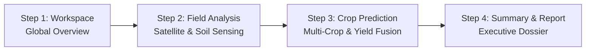

# 🌍 GeoAgri AI – Global Geospatial Agricultural Intelligence

> **Next-Generation Planetary Agricultural Decision Support System (DSS)**  
> Location-driven multi-crop recommendation, probabilistic quantile yield forecasting (P10 / P50 / P90), hydrological water balance, symbiotic companion intercropping (+15%), and climate risk resilience across all global agro-climatic zones.

[](https://geoagri-ai.vercel.app)
[](https://geoagri-backend.onrender.com/docs)
[](https://opensource.org/licenses/MIT)

[](https://fastapi.tiangolo.com)
[](https://reactjs.org)
[](https://vitejs.dev)
[](https://www.typescriptlang.org/)
[](https://www.python.org/)
[](https://www.docker.com/)

---

## 🌐 Live Deployments

| Component | Platform | URL | Documentation |
| :--- | :--- | :--- | :--- |
| **Frontend Web App** | Vercel | [https://geoagri-ai.vercel.app](https://geoagri-ai.vercel.app) | React 18, Vite, TypeScript, MapLibre GL |
| **Backend API Service** | Render | [https://geoagri-backend.onrender.com](https://geoagri-backend.onrender.com) | FastAPI, Python 3.11, Uvicorn |
| **Interactive API Docs** | Swagger UI | [https://geoagri-backend.onrender.com/docs](https://geoagri-backend.onrender.com/docs) | OpenAPI 3.0 Specification |
| **Service Health Check** | Health API | [https://geoagri-backend.onrender.com/api/v1/health](https://geoagri-backend.onrender.com/api/v1/health) | Real-time sensor & telemetry status |

---

## 📋 Table of Contents

- [Overview](#-overview)
- [Key Features](#-key-features)
- [4-Step Intelligence Workflow](#-4-step-intelligence-workflow)
- [Explainable AI Advisor (Copilot Chatbot)](#-explainable-ai-advisor-copilot-chatbot)
- [System Architecture](#-system-architecture)
- [The 5 Core AI Models (Parallel Async Pipeline)](#-the-5-core-ai-models-parallel-async-pipeline)
- [78-Layer Geospatial Feature Pipeline](#-78-layer-geospatial-feature-pipeline)
- [Multi-Attribute Decision Fusion Engine](#-multi-attribute-decision-fusion-engine)
- [Symbiotic Intercropping Optimization](#-symbiotic-intercropping-optimization)
- [Project Structure](#-project-structure)
- [Tech Stack](#-tech-stack)
- [Getting Started](#-getting-started)
  - [Prerequisites](#prerequisites)
  - [Backend Setup (FastAPI)](#1-backend-setup-fastapi)
  - [Frontend Setup (React + Vite)](#2-frontend-setup-react--vite)
  - [Running Both Simultaneously](#3-running-both-simultaneously)
- [Deployment Guide (Render & Vercel)](#-deployment-guide-render--vercel)
- [API Reference](#-api-reference)
- [Testing & Quality Assurance](#-testing--quality-assurance)
- [Configuration & Environment Variables](#-configuration--environment-variables)
- [Resilience & Fallback Architecture](#-resilience--fallback-architecture)
- [License](#-license)

---

## 🌟 Overview

**GeoAgri AI** is a planetary precision agriculture intelligence platform designed to empower farmers, agronomists, commercial agribusinesses, and policy planners with data-driven decision intelligence.

By fusing **multispectral satellite observations (Sentinel-2 MSI)**, **all-weather synthetic aperture radar (Sentinel-1 SAR)**, **30-meter topographic digital elevation models (SRTM / Copernicus DEM)**, **high-resolution 3D soil physical and chemical properties (ISRIC SoilGrids 250m)**, and **gridded 40-year agro-meteorological climatology (NASA POWER / ERA5-Land)**, GeoAgri AI delivers farm-specific intelligence anywhere on Earth.

Unlike traditional agricultural tools that query static rule tables for a single region, GeoAgri AI executes a **78-layer geospatial feature extraction pipeline** feeding **5 specialized machine learning and agronomic models concurrently**, followed by a **multi-attribute decision fusion engine** that generates tailored crop rankings, companion pairings, probabilistic yield uncertainty distributions, and hydrological strategies.

---

## 🚀 Key Features

### 1. 🤖 Explainable AI Advisor (Copilot Chatbot)
- Embedded slide-out drawer accessible from any page via the robot advisor icon in the navigation header.
- **Context-Aware NLP Knowledge Engine:** Explains complex technical indices in simple, plain English:
  - **Vegetation & Moisture Indices:** NDVI (formula, -1.0 to +1.0 thresholds), NDMI, NDWI, EVI, SAVI.
  - **All-Weather Microwave Radar:** Sentinel-1 VV (surface soil roughness) & VH (canopy volume scattering) in decibels (dB).
  - **Soil Chemistry & Lithology:** Topsoil pH acidity/alkalinity scales and Soil Organic Carbon (SOC in g/kg).
  - **Terrain Topography:** Elevation MSL, slope stability degrees, and Topographic Wetness Index (TWI).
  - **Probabilistic Yield Modeling:** Explains P10 (pessimistic), P50 (median expected), and P90 (optimistic) yield boundaries.
  - **Metric Units:** Plain-language conversions for Hectares (`ha`) vs. Acres, and Tonnes per Hectare (`t/ha`).
- **Live Active Parcel Summary:** Pulls real telemetry from the user's active field (coordinates, soil pH, SOC, NDVI, top crop) for customized analysis.

### 2. 🗺️ Global Precision Land Sensing & Safety Guardrails
- **Worldwide Coordinates Support:** Pinpoint fields anywhere across the globe—from the California Central Valley and Argentine Pampas to the Nile Delta and Indo-Gangetic Plains.
- **Non-Arable Terrestrial & Aquatic Guardrails:** Automatically identifies open oceans, lakes, and polar permafrost regions (e.g. Greenland, Antarctica), locking suitability to 0% with clear limiting factors and repositioning guidance.
- **Multi-Layer Base Maps:** Toggle smoothly between OpenStreetMap, high-resolution satellite orthophotos, and topographic terrain.

### 3. 🌾 Multi-Crop Decision Synthesis & Companion Intercropping (+15%)
- Evaluates commercial crops across cereals, pulses, oilseeds, cash crops, vegetables, and agroforestry.
- **75:25 Symbiotic Intercrop Optimization:** Ranks companion legume combinations (e.g. Finger Millet + Cowpea, Maize + Black Gram) that deliver **+12% to +18% yield synergy** through atmospheric nitrogen fixation and canopy stratification.

### 4. 📊 Probabilistic Quantile Yield Modeling (P10 / P50 / P90)
- Quantifies agricultural uncertainty instead of giving a single deterministic guess:
  - **P10 (10th Percentile / Pessimistic):** Downside safety floor under severe drought, heat, or delayed precipitation (90% chance actual yield will exceed this).
  - **P50 (50th Percentile / Median Expected):** Most probable harvest potential under standard management.
  - **P90 (90th Percentile / Optimistic):** Bumper harvest potential under ideal moisture distribution and nutrient uptake.

### 5. 💧 Hydrological Water Balance & Irrigation Strategy
- Calculates reference evapotranspiration ($ET_0 \times K_c$), effective seasonal precipitation, and root-zone water storage.
- Prescribes clear water management modes: **Rainfed**, **Supplemental Irrigation**, or **Full Irrigation** with exact seasonal cubic meter ($m^3$) requirements.

### 6. 📑 Executive 3-Page Agricultural Intelligence Dossier (PDF Export)
- Generate a printable, publication-grade executive PDF intelligence report formatted for bank crop insurance, farm managers, and agronomists.

### 7. 🎨 Executive Enterprise Design System
- Modern glassmorphism UI with curated HSL color palettes and dynamic ambient particle animations.
- Full high-contrast support for both **Dark Mode** and **Light Mode**.
- Responsive 2-column Additional Agronomic Crop Insights grid.
- Clickable header brand logo for instant navigation back to the Workspace.

---

## 🔄 4-Step Intelligence Workflow

GeoAgri AI guides users through a seamless 4-step progressive intelligence pipeline:



1. **Step 1: Workspace (Overview)**  
   System architecture dashboard, global agricultural region presets, satellite telemetry engine overview, and global parcel search.
2. **Step 2: Location & Field Analysis (Location & Satellite)**  
   Interactive geodesic parcel boundary selector, real-time area calculation (`ha` and `acres`), multi-spectral Sentinel-1/2 telemetry, SoilGrids chemical profiles, and Model A Land Suitability Assessment.
3. **Step 3: Crop Prediction (Multi-Crop & Yield)**  
   Top 5 multi-crop rankings, 2-column deep agronomic profiling, interactive yield uncertainty charts (P10/P50/P90), and the structured 4-card AI Agricultural Action Plan.
4. **Step 4: Summary & Report (Full Intelligence)**  
   Executive agricultural intelligence dossier, water balance ledger, climate risk scorecard, and one-click printable PDF report generation.

---

## 🤖 Explainable AI Advisor (Copilot Chatbot)

To bridge the gap between complex remote-sensing metrics and practical farming decisions, GeoAgri AI features a built-in **Explainable AI Advisor**:

```
+-------------------------------------------------------------+
| 🤖 Explainable AI Advisor                            [↺] [✕] |
| Active Field: Chikkamagaluru (13.92°N, 75.46°E • 2.85 ha)   |
+-------------------------------------------------------------+
| 💬 User: "What is NDVI and what does my value mean?"        |
|                                                             |
| 🤖 Advisor:                                                 |
| ### 🛰️ Normalized Difference Vegetation Index (NDVI)        |
| NDVI measures how green, dense, and healthy plants are by   |
| comparing Near-Infrared (reflected) and Red (absorbed) light.|
| Formula: (NIR - Red) / (NIR + Red)                          |
| Range: -1.0 (water) to +1.0 (dense canopy)                  |
|                                                             |
| 📍 Your Active Field:                                       |
| NDVI is 0.59 -> Healthy, dense vegetative crop canopy.      |
+-------------------------------------------------------------+
| [What is SOC?] [Explain P50 Yield] [What is a Hectare?]     |
| [Ask about NDVI, SOC, elevation, P50, t/ha, workflow...  ➤] |
+-------------------------------------------------------------+
```

---

## 🏗 System Architecture

```mermaid
flowchart TD
    User([User / Agronomist / Enterprise]) <--> UI[React 18 + Vite + TypeScript Frontend]
    
    subgraph Frontend_App ["Frontend Client Layer (Vercel)"]
        UI --> MapEngine[MapLibre GL / OpenStreetMap]
        UI --> ChatDrawer[Explainable AI Advisor Drawer]
        UI --> Charts[Recharts Yield & Risk Analytics]
        UI --> PDF[Executive Dossier Print Engine]
    end
    
    UI -->|API Proxy: /api/v1/*| API_Gateway[FastAPI Backend Gateway (Render)]
    
    subgraph Backend_Engine ["FastAPI Processing Core"]
        API_Gateway --> Router[Prediction & Field Routers]
        Router --> ProfileBuilder[Environmental Profile Builder]
        
        subgraph Data_Sources ["Global Geospatial Ingestion Services"]
            ProfileBuilder --> GEE[Google Earth Engine<br/>Sentinel-2 MSI, Sentinel-1 SAR]
            ProfileBuilder --> NASA[NASA POWER API<br/>40-Yr Solar & Meteorology]
            ProfileBuilder --> Soil[ISRIC SoilGrids 250m<br/>Depth-Graded Physical & Chemical]
            ProfileBuilder --> Geodesic[WGS84 Geodesic Engine<br/>Polygon Surface Area]
        end
        
        ProfileBuilder --> Pipe[78-Layer Geospatial Feature Pipeline]
        
        subgraph Model_Registry ["Parallel Model Execution (asyncio.gather)"]
            Pipe --> MA[Model A: FAO Land Suitability Classifier]
            Pipe --> MB[Model B: Multi-Crop Ensemble Recommender]
            Pipe --> MC[Model C: Hydrological Water Balance Engine]
            Pipe --> MD[Model D: Quantile Yield Regressors P10/P50/P90]
            Pipe --> ME[Model E: Agro-Climatic Stress & Hazard Scorer]
        end
        
        MA & MB & MC & MD & ME --> Fusion[Multi-Attribute Decision Fusion Engine]
        Fusion --> Intercrop[Symbiotic Intercrop Pairing Engine]
    end
    
    Intercrop -->|Full Report JSON| UI
```

---

## 🔬 The 5 Core AI Models (Parallel Async Pipeline)

When a location is selected, the backend triggers **5 specialized machine learning and agronomic models concurrently** via Python's `asyncio.gather`:

| Model | Component Name | Algorithm / Methodology | Primary Output |
| :--- | :--- | :--- | :--- |
| **Model A** | **Land Suitability Classifier** | FAO Framework + Multi-criteria parametric evaluation | Suitability Score (0–100%), FAO Grade (`High`, `Moderate`, `Low`, `Not Suitable`), Limiting Factors |
| **Model B** | **Multi-Crop Recommender** | Gradient Boosting + Random Forest classification trained on global agro-ecological envelopes | Ranked crops list with recommendation confidence scores (0.0 to 1.0) |
| **Model C** | **Irrigation Feasibility Engine** | FAO-56 Penman-Monteith reference evapotranspiration ($ET_0$) & root-zone water balance | Water demand ($m^3$), recommended mode (`Rainfed`, `Supplemental`, `Full`), water deficit |
| **Model D** | **Quantile Yield Regressors** | Quantile Gradient Boosting Regressors ($\alpha = 0.1, 0.5, 0.9$) | Risk-adjusted yield distributions: **P10 (Pessimistic)**, **P50 (Median Expected)**, **P90 (Optimistic)** in `t/ha` |
| **Model E** | **Climate Stress & Hazard Scorer** | Phenological degree-day modeling & extreme weather threshold analysis | Drought stress score, heat shock vulnerability, excess rainfall probability, hazard notes |

---

## 🧬 78-Layer Geospatial Feature Pipeline

Every coordinate queried is transformed into a dense, 78-dimensional feature vector:

```
+-------------------------------------------------------------------------+
|                  78-DIMENSIONAL FEATURE VECTOR LAYERS                   |
+-------------------------------------------------------------------------+
| 1. Optical Spectral Indices (12) | NDVI, NDMI, NDWI, EVI, SAVI, B2-B12   |
| 2. SAR Microwave Radar (8)       | Sentinel-1 VV, VH, VV/VH ratio, RVI  |
| 3. Topography & Terrain (8)      | Elevation (m), Slope (°), Aspect, TWI |
| 4. Soil Physical & Chemical (20) | pH, SOC (g/kg), N, P, K, Clay/Sand/Silt|
| 5. Meteorological Thermal (16)   | T_mean, T_min, T_max, GDD, Diurnal    |
| 6. Hydrological Precipitation (14)| Rainfall (mm), Wet days, Deficit, PET |
+-------------------------------------------------------------------------+
```

---

## 🤝 Symbiotic Intercropping Optimization

To promote regenerative agriculture and maximize land productivity, GeoAgri AI pairs primary crops with symbiotic companions in a **75:25 spatial allocation**:

$$\text{Total Production} = \left(0.75 \times Y_{\text{main}} \times (1 + \Delta_{\text{synergy}})\right) + \left(0.25 \times Y_{\text{companion}}\right)$$

### Key Agronomic Synergies:
1. **Atmospheric Nitrogen Fixation:** Legume companions (e.g. Cowpea, Black Gram) fix $N_2$ via *Rhizobium* root nodules, reducing synthetic fertilizer costs.
2. **Canopy Stratification:** Tall C4 crops (e.g. Maize, Sorghum, Millet) harvest high-angle sunlight while ground-hugging legumes shade topsoil, suppressing weed growth and cutting soil evaporation by up to 30%.
3. **Pest Disruption:** Polyculture plantings break insect pest lifecycles, mitigating seasonal crop failure risk.

---

## 📁 Project Structure

```
GeoAgri/
├── backend/                         # FastAPI Application Core
│   ├── app/
│   │   ├── api/v1/                  # API Route Controllers
│   │   │   ├── predict.py           # Full report prediction endpoints
│   │   │   ├── field.py             # Geodesic area & boundary endpoints
│   │   │   └── health.py            # Diagnostic & health check endpoints
│   │   ├── core/                    # Application Configuration & Settings
│   │   ├── models/                  # Pydantic Request/Response Schemas
│   │   └── services/                # Geospatial & ML Business Logic
│   │       ├── environmental_profile_builder.py
│   │       ├── decision_fusion.py   # Multi-attribute fusion engine
│   │       ├── intercrop_service.py # Companion crop pairing engine
│   │       ├── gee_service.py       # Google Earth Engine client
│   │       ├── nasa_power_service.py# NASA meteorology client
│   │       └── soilgrids_service.py # ISRIC SoilGrids 250m client
│   ├── ml/                          # Machine Learning Pipeline
│   │   ├── data/                    # Datasets (raw & processed)
│   │   ├── models/                  # Serialized Joblib model binaries
│   │   └── training/                # Training, preprocessing & feature selection
│   ├── tests/                       # Pytest automated test suites
│   ├── requirements.txt             # Python backend dependencies
│   └── Dockerfile                   # Backend production container
├── frontend/                        # React 18 + Vite + TypeScript Application
│   ├── src/
│   │   ├── api/                     # Backend API Client (with timeout & retry)
│   │   ├── components/              # Modular UI Components
│   │   │   ├── AgriChatBot/         # Explainable AI Advisor slide-out drawer
│   │   │   ├── BottomWorkflowNav/   # 4-step progressive workflow stepper
│   │   │   ├── CropRecommendationCard/
│   │   │   ├── GeoAgriLogo/         # Custom SVG brand mark
│   │   │   ├── MapSelector/         # MapLibre GL interactive parcel map
│   │   │   ├── PageHeader/          # Enterprise header with theme & advisor toggle
│   │   │   ├── ReportDownloadButton/# High-resolution PDF export engine
│   │   │   ├── SuitabilityBanner/   # FAO grade & diagnostic confidence banner
│   │   │   ├── YieldComparisonChart/
│   │   │   └── YieldPredictionTable/# Probabilistic P10/P50/P90 table
│   │   ├── context/                 # Workflow React Context State Provider
│   │   ├── pages/                   # 4 Core Workflow Pages
│   │   │   ├── WorkspacePage.tsx    # Step 1: Global overview
│   │   │   ├── FieldAnalysisPage.tsx# Step 2: Location & satellite telemetry
│   │   │   ├── CropPredictionPage.tsx# Step 3: Multi-crop & yield decision fusion
│   │   │   └── SummaryReportPage.tsx# Step 4: Executive intelligence dossier
│   │   ├── utils/                   # Agronomic formatters & dataset presets
│   │   ├── index.css                # Enterprise design system CSS
│   │   └── App.tsx                  # Root application layout
│   ├── package.json                 # Frontend dependencies
│   └── vite.config.ts               # Vite bundler configuration
├── docker-compose.yml               # Multi-container local orchestration
├── render.yaml                      # Render Blueprint infrastructure as code
├── vercel.json                      # Vercel deployment & API proxy configuration
└── README.md                        # Documentation
```

---

## 💻 Tech Stack

### Backend
- **Framework:** [FastAPI](https://fastapi.tiangolo.com) (Python 3.11)
- **Server:** [Uvicorn](https://www.uvicorn.org) (ASGI high-performance server)
- **Machine Learning:** [scikit-learn](https://scikit-learn.org), [LightGBM](https://lightgbm.readthedocs.io), [NumPy](https://numpy.org), [Pandas](https://pandas.pydata.org), [Joblib](https://joblib.readthedocs.io)
- **Geospatial Processing:** [Shapely](https://shapely.readthedocs.io), [Pyproj](https://pyproj4.github.io/pyproj), [Google Earth Engine API (`earthengine-api`)](https://earthengine.google.com)
- **Data Validation:** [Pydantic v2](https://docs.pydantic.dev)
- **Testing:** [Pytest](https://pytest.org), [HTTPX](https://www.python-httpx.org)

### Frontend
- **Framework:** [React 18](https://react.dev) with [TypeScript](https://www.typescriptlang.org)
- **Build Tool:** [Vite 5](https://vitejs.dev)
- **GIS Mapping:** [MapLibre GL JS](https://maplibre.org) / [Leaflet](https://leafletjs.com)
- **Data Visualization:** [Recharts](https://recharts.org)
- **UI Icons:** [Lucide React](https://lucide.dev)
- **Styling:** Modular Vanilla CSS Design System with CSS variables and responsive grid

---

## 🚀 Getting Started

### Prerequisites
- **Python:** 3.11 or higher
- **Node.js:** 18.x or higher (LTS recommended)
- **npm:** 9.x or higher
- **Git**

---

### 1. Backend Setup (FastAPI)

```bash
# Clone repository
git clone https://github.com/lokeshpuma/GeoAgri.git
cd GeoAgri/backend

# Create and activate virtual environment
python3 -m venv venv
source venv/bin/activate  # On Windows: venv\Scripts\activate

# Install dependencies
pip install --upgrade pip
pip install -r requirements.txt

# Start backend development server
uvicorn app.main:app --host 0.0.0.0 --port 8000 --reload
```

The backend will be live at `http://localhost:8000`.  
Explore the interactive Swagger UI at `http://localhost:8000/docs`.

---

### 2. Frontend Setup (React + Vite)

```bash
# In a new terminal window:
cd GeoAgri/frontend

# Install dependencies
npm install

# Start Vite frontend development server
npm run dev
```

The frontend application will be running at `http://localhost:3000`.

---

### 3. Docker Compose (One-Command Launch)

Run the full platform using Docker Compose:

```bash
docker-compose up --build
```

- Frontend: `http://localhost:3000`
- Backend API: `http://localhost:8000`
- API Documentation: `http://localhost:8000/docs`

---

## ☁️ Deployment Guide (Render & Vercel)

GeoAgri AI is production-optimized for seamless cloud deployment:

### Backend Deployment on [Render](https://render.com)
1. Fork or push this repository to your GitHub account.
2. Log into the Render Dashboard and click **New +** -> **Web Service**.
3. Connect your repository and configure:
   - **Root Directory:** `backend`
   - **Environment:** `Python 3`
   - **Build Command:** `pip install --upgrade pip && pip install -r requirements.txt`
   - **Start Command:** `uvicorn app.main:app --host 0.0.0.0 --port $PORT`
   - **Health Check Path:** `/api/v1/health`
4. In **Environment Variables**, add:
   - `ENV`: `production`
   - `GEE_MOCK_FALLBACK`: `true`
5. Click **Create Web Service**. Your live backend URL will be: `https://<service-name>.onrender.com`.

---

### Frontend Deployment on [Vercel](https://vercel.com)
1. Log into Vercel and click **Add New...** -> **Project**.
2. Select your `GeoAgri` repository.
3. Configure project settings:
   - **Framework Preset:** `Vite`
   - **Root Directory:** `./`
   - The included [`vercel.json`](./vercel.json) automatically routes static assets and proxies API calls to the Render backend:
     ```json
     {
       "routes": [
         { "src": "/api/(.*)", "dest": "https://geoagri-backend.onrender.com/api/$1" },
         { "src": "/assets/(.*)", "dest": "/frontend/dist/assets/$1" },
         { "src": "/(.*)", "dest": "/frontend/dist/index.html" }
       ]
     }
     ```
4. Click **Deploy**. Vercel will build and deploy the application with zero additional configuration needed.

---

## 📡 API Reference

### 1. Generate Full Agricultural Decision Report
- **Endpoint:** `POST /api/v1/predict/full-report`
- **Content-Type:** `application/json`

**Sample Request Body:**
```json
{
  "point": [13.9209, 75.4639],
  "polygon": null,
  "season": "kharif",
  "limit": 10,
  "area_ha": 2.85,
  "irrigation_preference": "rainfed",
  "manual_soil": {
    "ph": 6.2,
    "organic_carbon": 8.5
  }
}
```

**Key Response Structure:**
```json
{
  "field_summary": {
    "area_ha": 2.85,
    "centroid_lat": 13.9209,
    "centroid_lon": 75.4639,
    "polygon_valid": true
  },
  "land_suitability": {
    "grade": "High",
    "score": 0.83,
    "confidence": 0.90,
    "limiting_factors": []
  },
  "recommended_crops": [
    {
      "crop_id": "cereal_finger_millet",
      "crop_name": "Finger Millet (Ragi)",
      "category": "cereals",
      "recommendation_score": 0.83,
      "expected_yield_t_ha": { "p10": 0.93, "p50": 1.56, "p90": 2.56 },
      "irrigation_mode": "rainfed",
      "intercrop_options": [
        {
          "companion_crop_name": "Cowpea (Lobia)",
          "yield_boost_pct": 0.15
        }
      ]
    }
  ],
  "irrigation_summary": {
    "recommended_mode": "Rainfed",
    "total_water_demand_m3": 11400,
    "effective_rainfall_mm": 789.8
  },
  "climate_risk_summary": {
    "overall_risk_level": "Low",
    "drought_risk_score": 6,
    "heat_risk_score": 5
  }
}
```

---

### 2. Instant Geodesic Field Area Calculation
- **Endpoint:** `POST /api/v1/field/area`
- **Description:** Computes exact surface area on the WGS84 ellipsoid for interactive polygon drawings.

---

### 3. List Registered Crops
- **Endpoint:** `GET /api/v1/crops`
- **Description:** Returns the complete registry of agricultural crop species with baseline agronomic ranges.

---

### 4. Health & Sensor Diagnostics
- **Endpoint:** `GET /api/v1/health`
- **Description:** Validates operational status of GEE satellite feeds, NASA POWER, and SoilGrids APIs.

---

## 🧪 Testing & Quality Assurance

Run the automated test suite covering all architectural phases:

```bash
cd backend
source venv/bin/activate
pytest -v
```

### Test Suite Coverage:
- `tests/test_phase2_data.py`: Validates crop datasets, normalizations, and schema integrity.
- `tests/test_phase3_geo_services.py`: Tests GEE satellite extraction, NASA POWER, and SoilGrids client connectivity.
- `tests/test_phase4_features.py`: Verifies the 78-layer feature extraction pipeline.
- `tests/test_phase5_models.py`: Validates output ranges and boundary conditions for Models A through E.
- `tests/test_phase6_fusion.py`: Verifies multi-attribute decision weighting and ranking logic.
- `tests/test_phase7_api.py`: End-to-end integration tests for all API endpoints.

---

## ⚙️ Configuration & Environment Variables

| Variable | Default Value | Description |
| :--- | :--- | :--- |
| `ENV` | `development` | Runtime environment (`development` / `production`) |
| `LOG_LEVEL` | `INFO` | Application logging level (`DEBUG`, `INFO`, `WARNING`) |
| `GEE_MOCK_FALLBACK` | `true` | When `true`, enables synthetic satellite fallback when Google Cloud GEE keys are not mounted |
| `GEE_SERVICE_ACCOUNT` | `""` | Google Earth Engine service account email |
| `GEE_PRIVATE_KEY_PATH`| `""` | Path to Google Earth Engine private service key JSON |
| `NASA_POWER_API_URL` | `https://power.larc.nasa.gov/...` | NASA POWER point climatology API endpoint |
| `SOILGRIDS_API_URL` | `https://rest.isric.org/...` | ISRIC SoilGrids REST API endpoint |
| `WEIGHT_LAND_SUITABILITY` | `0.20` | Weight of FAO Land Suitability in Decision Fusion |
| `WEIGHT_CROP_RECOMMENDATION`| `0.25` | Weight of Model B ML recommendation score |
| `WEIGHT_IRRIGATION_COST` | `0.15` | Penalty weight for irrigation water deficit |
| `WEIGHT_YIELD` | `0.25` | Weight of expected yield potential |
| `WEIGHT_CLIMATE_RISK` | `0.15` | Penalty weight for climate stress vulnerability |
| `CACHE_TTL_SECONDS` | `86400` | Geospatial and weather query cache time-to-live (seconds) |

---

## 🛡 Resilience & Fallback Architecture

Agricultural technology must function reliably in remote regions with variable network connectivity. GeoAgri AI guarantees zero-downtime resilience through **graceful degradation**:

1. **API Fallbacks:**  
   If Google Earth Engine, NASA POWER, or ISRIC SoilGrids encounters rate limits or connection interruptions, the platform immediately activates local bioclimatic and spatial estimation models.
2. **Model Isolation:**  
   If any single AI model encounters a runtime anomaly, that specific model degrades to its certified agronomic heuristic table while setting its status flag to `fallback`. The remaining four models continue running at full fidelity.
3. **Manual Overrides:**  
   Any remote sensing or digital soil layer can be manually superseded with physical laboratory soil test reports directly from the user interface.
4. **Cold-Start Resilience:**  
   The frontend API client includes a 90-second timeout controller and automatic retry handling to gracefully accommodate free-tier cloud instance wake-ups.

---

## 📄 License

This project is licensed under the **MIT License** - see the [LICENSE](./LICENSE) file for details.
